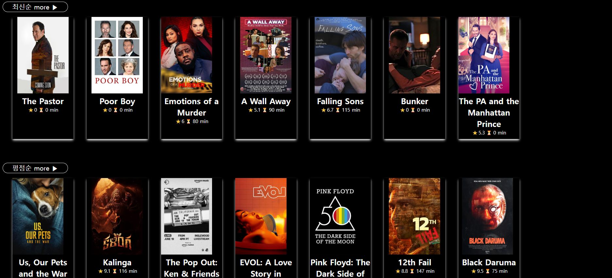
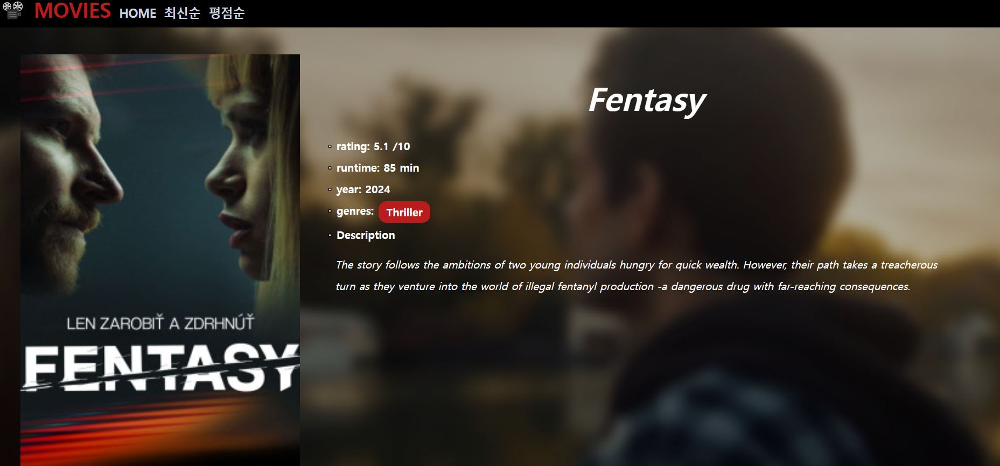

# 🎥 movie app   
* 무료 영화 API를 통해 영화앱을 구현. 
*  **Data sorting**을 통해 주어진 API를 다양한 형태로, 목적(최신순, 평점순, 갯수제한)에 맞게 변형해 활용해본다.    

### ✅ 완성 페이지 ([ 🚀보러가기 ](https://movie-app-tailwind-pi.vercel.app/))   
1. MAIN

   
2. Pages   
   
3. Detail Page   
  

### ✅ 기능   
* 목적별 페이지 제공 (최신순, 평점순)   
  *  API Fectching & sorting      
     
     
* 페이지 세분화   
  * router를 통한 페이지 구분   
    
  * useParams hook을 활용해 동적 페이지 구현   

### ✅ 기술스택    
* Module Bundler : vite-app   
* Library : React
* styling : tailwind   
* routing library : React Router dom
* Data Fetching : Fetch( ) API